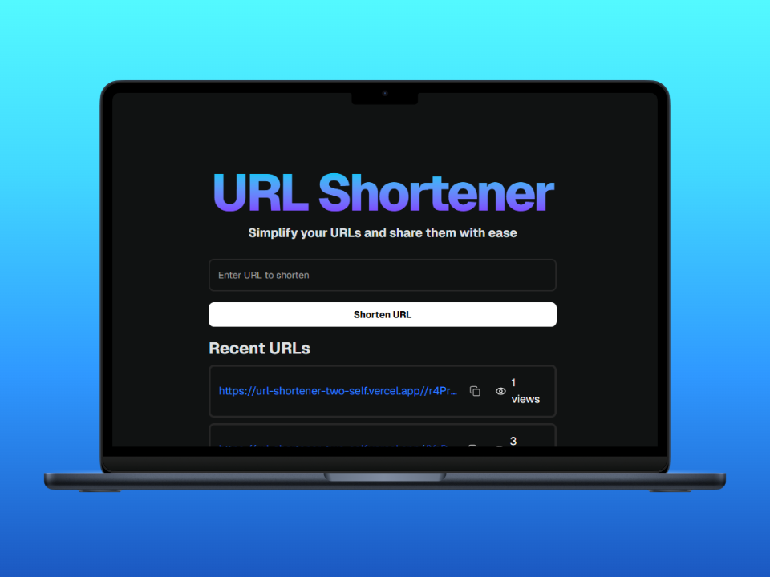

# URL Shortener


## Description

URL Shortener is a web application that allows users to shorten long URLs into concise, easy-to-share links.

## Features

- Generate short URLs instantly

- Track the number of visits for each shortened link

- Database management with Prisma ORM

- Responsive design for mobile and desktop

- Dark/Light theme


## Technologies Used

- Next.js – React framework for server-side rendering and static site generation

- TypeScript – Strongly typed JavaScript

- ShadCN/UI – Modern UI components
- Supabase – Open-source Firebase alternative for authentication and database management
- Prisma – Next-generation ORM for database interactions
- Framer Motion – Animation library

- Tailwind CSS – Utility-first CSS framework

- Lucide Icons – Open-source icon set

- Sonner – Notification library

## Getting Started

Clone this repository:
```bash
git clone https://github.com/ivanespinola/url-shortener.git
cd url-shortener
```
Set up environment variables in a .env.local file:
```bash
NEXT_PUBLIC_SUPABASE_URL=your_supabase_url
NEXT_PUBLIC_SUPABASE_ANON_KEY=your_supabase_anon_key
DATABASE_URL=your_database_url
```
Install dependencies:
```bash
npm install
```
Run the development server:

```bash
npm run dev
# or
yarn dev
# or
pnpm dev
# or
bun dev
```

Open [http://localhost:3000](http://localhost:3000) with your browser to see the result.

You can start editing the page by modifying `app/page.tsx`. The page auto-updates as you edit the file.

This project uses [`next/font`](https://nextjs.org/docs/app/building-your-application/optimizing/fonts) to automatically optimize and load [Geist](https://vercel.com/font), a new font family for Vercel.

## Learn More

To learn more about Next.js, take a look at the following resources:

- [Next.js Documentation](https://nextjs.org/docs) - learn about Next.js features and API.
- [Learn Next.js](https://nextjs.org/learn) - an interactive Next.js tutorial.

You can check out [the Next.js GitHub repository](https://github.com/vercel/next.js) - your feedback and contributions are welcome!

## Live Demo

Check out the live demo of the project [here](https://url-shortener-two-self.vercel.app/).

## Deploy on Vercel

The easiest way to deploy your Next.js app is to use the [Vercel Platform](https://vercel.com/new?utm_medium=default-template&filter=next.js&utm_source=create-next-app&utm_campaign=create-next-app-readme) from the creators of Next.js.

Check out our [Next.js deployment documentation](https://nextjs.org/docs/app/building-your-application/deploying) for more details.

## License 

This project is licensed under the MIT License. 
